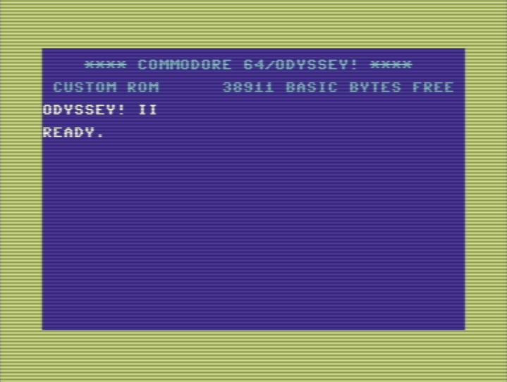

# COMMODORE 64/ODYSSEY II
"Blizzard Chip" - DR ROMS C64 Odyssey I/II - a fastload KERNAL ROM replacement for the Commodore 64 (NTSC)

 I originally [posted this on the Internet Archive](https://archive.org/details/BlizzardChipDRROMSC64Odyssey), but I'm mirroring it here on GitHub just in case. The world will not lose this obscure ROM!

-------------------
## C64 ODYSSEY by Dr ROMs

Published January 1, 1985
Topics Commodore, 64, C64, KERNAL, KERNEL, ROM, 27128

This is a replacement KERNAL ROM for the NTSC Commodore 64. It has some unspecified bugfixes as well as a few added/changed features. It was created by some dude near Peoria, Illinois in the 1980s. I haven't been able to find any further information about it. It will boot on a PAL C64, but acts real wacky and is generally not stable, so just don't bother with anything but an NTSC unit.

Odyssey! is a fastload ROM with reasonable levels of compatibility. Shift-RunStop will load the first program on drive 8, rather than loading from tape. Holding down F1 while powering the computer on will cause it to enter Odyssey! II, a further-enhanced fastload mode. In either mode, you also get that neat yellow border instead of the old drab blue one.

Blow this ROM image onto a 27128 EPROM and socket it, with an appropriate pinout adapter, into your C64's KERNAL ROM socket. A switch that toggles between two halves of the 27128 will allow you to swap into the bone-stock C64 KERNAL ROM, if needed, a copy of which is included in the .BIN file. Suitable adapters with switches are available for purchase on the Internet at e.g. eBay.

The 8KB 'kernal' file provided is a chopped version of the raw ROM dump, and can be used to directly replace the file of the same name in the VICE emulator.

----------------------------

Identifier BlizzardChipDRROMSC64Odyssey

Mediatype software

Creator Dr ROMs

Date 1985-01-01

Scanner Internet Archive HTML5 Uploader 1.6.3

Publicdate 2016-10-31 11:08:04

Addeddate 2016-10-31 11:08:04

Year 1985

Backup_location ia906209_33

Language English
